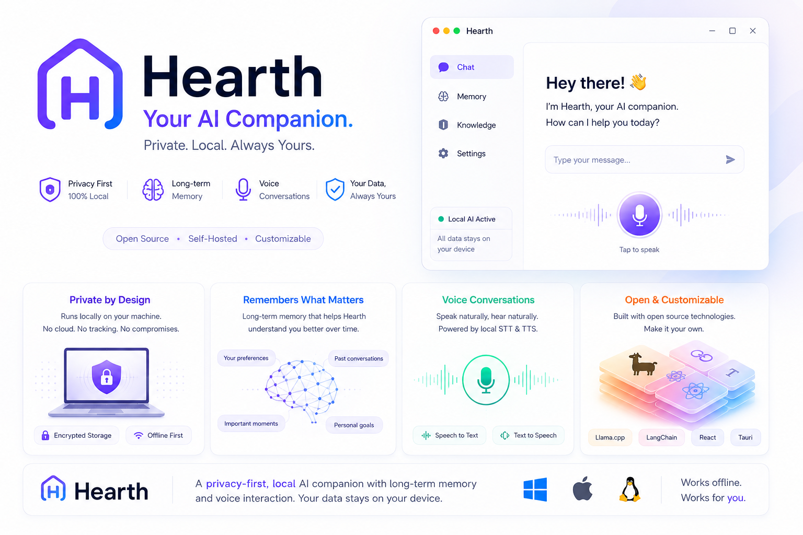

# Hearth

A privacy-first personal AI companion that remembers what matters to you —
and runs entirely on your own machine. No data leaves your device except
one narrow, explicitly consented path (crisis escalation) — see
[`docs/privacy.md`](docs/privacy.md).

```
mic → Moonshine (STT) → LFM2.5 via a LangChain agent → Parler-TTS-Tiny-v1/Kokoro (TTS) → speaker
```

Most companions forget you between sessions, or remember you on someone
else's servers. Hearth does neither: it builds a long-term picture of your
life — what you're working on, who matters to you, what you've been
carrying — and that picture stays on your disk, encrypted, yours to read,
correct, or delete.

## What Hearth is — and isn't

Hearth is for reflection, journaling, everyday conversation, remembering
your goals and experiences, and noticing patterns over time.

Hearth is **not** a therapist, not a medical device, and not a crisis
service. It does not diagnose, treat, or prevent any condition, and it is
not a substitute for professional care. When a conversation suggests
someone is at risk, Hearth's job is to respond safely and point toward
real human help — not to handle it alone. It is intended for adults
(18+). See [`docs/compliance.md`](docs/compliance.md) for the reasoning and
the current gaps.

Emotional support is one capability here, not the product's purpose. That
distinction is deliberate — see [`docs/positioning.md`](docs/positioning.md).

For the full design history and rationale, see
[`docs/project-plan.md`](docs/project-plan.md) and [`project-phases.md`](project-phases.md).
For how the app actually works today, see [`docs/architecture.md`](docs/architecture.md).

## Stack

LFM2.5-1.2B (LLM, via `llama-server`) · Moonshine (STT) · Parler-TTS-Tiny-v1
with a Kokoro-82M fallback (TTS) · EmbeddingGemma-300M + Chroma (long-term
memory) · LangChain `create_agent` (tool-calling agent + middleware) ·
FastAPI (backend) · React/Vite (frontend) · Tauri (desktop packaging).

## Project layout

```
backend/     FastAPI app, all model work (STT/LLM/TTS), REST + websocket API
frontend/    React/Vite web app (onboarding, chat, settings)
desktop/     Tauri wrapper — packages frontend + backend into an installer
scripts/     hardware_check.py (tier probe), setup.py (manual/dev-only
             model downloads — the packaged app now does this in-app)
docs/        architecture.md, privacy.md, positioning.md, compliance.md
hearth_ai/   submodule — the from-scratch multi-task NLP model (shared
             encoder + emotion/intent/memory/relationship/strategy heads)
             and its training + ONNX export pipeline. Lives in its own repo
             (shockwave199129/hearth_ai) because it is a research/training
             project on a different cadence to the app, which consumes only
             its exported ONNX artifacts under models/nlp/.
```

`hearth_ai/` being a submodule means a plain `git clone` leaves it empty:

```bash
git clone --recurse-submodules https://github.com/shockwave199129/Hearth.git
# already cloned:  git submodule update --init --recursive
```

Nothing under `backend/` imports it at runtime, so an empty `hearth_ai/`
still runs and tests the app — but `ruff check backend scripts hearth_ai`
(the CI lint step) needs it populated.

Hardware is auto-detected and mapped to a tier (S/A/B/C) that picks model
sizes and quantizations accordingly — see `docs/architecture.md`'s
"Hardware tiering" section. Tier B/C (CPU-only or low RAM) still works, just
with a smaller model and a lighter TTS engine.

## Getting started

### Docker (recommended for a quick local stack)

Requires Docker Compose v2. With an NVIDIA GPU, also install the
[NVIDIA Container Toolkit](https://docs.nvidia.com/datacenter/cloud-native/container-toolkit/install-guide.html)
so containers can see the device.

```bash
./scripts/docker-up.sh --build
# force CPU:  ./scripts/docker-up.sh --cpu --build
# force GPU:  ./scripts/docker-up.sh --gpu --build
```

The helper attaches `docker-compose.gpu.yml` automatically when `nvidia-smi`
works **and** `docker run --gpus all … nvidia-smi` succeeds; otherwise it
uses the CPU image.

- UI: http://localhost:48176
- API: http://localhost:48173

First boot downloads the GGUF/TTS weights for the detected hardware tier
into a Docker volume (can take a while). Data and models persist across
restarts. Mic/speaker CLI mode is not wired through Docker — use the web
UI (browser captures audio).

To reuse models already on the host, bind-mount them in
`docker-compose.yml` (uncomment the `./backend/models` volume) and set
`HEARTH_SKIP_MODEL_SETUP=1` when the GGUFs are already present.

### 1. Prerequisites (non-Docker)

- Python 3.11+ and Node.js 20+
- [llama.cpp](https://github.com/ggerganov/llama.cpp)'s `llama-server`
  binary, built with Jinja chat-template support (needed for tool calling),
  and on your `PATH` (or set `LLAMA_SERVER_BIN` — see `backend/app/config.py`)

### 2. Backend setup

```bash
cd backend
python -m venv .venv && source .venv/bin/activate
pip install -r requirements-common.txt
pip install -r requirements-gpu.txt   # tier S/A — Parler-TTS-Tiny-v1
# or: pip install -r requirements-cpu.txt   # tier B/C — Kokoro TTS
```

Not sure which tier you are? Run `python ../scripts/hardware_check.py`
after installing `requirements-common.txt` — it prints your detected
hardware and tier (S/A -> requirements-gpu.txt, B/C -> requirements-cpu.txt).

Download the model files for your detected hardware tier:

```bash
python ../scripts/setup.py
```

This pulls the right LFM2.5 GGUF quantization and the EmbeddingGemma GGUF
for every tier. Moonshine, Parler-TTS-Tiny-v1, and Kokoro all auto-download
their own weights on first use — nothing to do for those.

Run the backend:

```bash
python -m app.main          # starts the FastAPI server on :8000
python -m app.main --cli    # or: talk to it directly via mic/speaker, no frontend needed
```

### 3. Frontend setup

Uses [pnpm](https://pnpm.io) (`npm install -g pnpm` if you don't have it):

```bash
cd frontend
pnpm install
pnpm run dev   # Vite dev server on :5173, proxies /api and /ws to :8000
```

Open `http://localhost:5173` — first launch walks you through onboarding
(you can create multiple profiles later from Settings → Profiles).

### 4. Desktop packaging (optional)

```bash
cd desktop
pnpm install
pnpm run tauri:dev     # run the desktop shell against the Vite dev server
pnpm run tauri:build   # build an installer for the current platform
```

**Windows local installer (CI parity, no tag needed):** from repo root in
PowerShell, `.\scripts\build_windows_installer.ps1` — then install the
MSI/NSIS under `desktop/src-tauri/target/release/bundle/`. (Use
`powershell -ExecutionPolicy Bypass -File .\scripts\build_windows_installer.ps1`
if scripts are blocked. You do not need the `pwsh` command.)

The packaged installer is a thin build — no torch/onnxruntime/parler-tts/
kokoro frozen in — and detects the installing machine's hardware on first
launch to install the matching TTS package and download models itself, in
the app UI (no manual `pip install`/`setup.py` needed for an installed
app). See [`desktop/src-tauri/README.md`](desktop/src-tauri/README.md) for
Linux build prerequisites, how that in-app setup flow works, and what's
still scaffold-only (real app icons).

## Where Hearth is supported

The code runs anywhere its dependencies do. **Supported** means something
narrower: verified crisis-resource data for that country, and safety
behaviour tested against it. Shipping a companion into a country whose
emergency numbers we haven't verified is the one failure mode that isn't
recoverable, so support is deliberately gated on that.

| Status | Regions |
|---|---|
| Resource data present | US, UK — `backend/app/safety2/resources/regions/` |
| Planned next | Canada, Australia, Ireland, New Zealand |
| Long-term | Markets with the highest measured need — see below |

First launch targets the **US**: the largest AI-companion market and the
one whose regulatory expectations we're designing to meet. English-speaking
high-income markets follow, since they need no model localization — only
verified regional resource data.

The countries with the *greatest* need are not the first ones we can
serve. Loneliness runs highest in Brazil, Turkey, and India, and the
mental-health treatment gap reaches ~75% in low- and middle-income
countries. Those markets are mobile-first and lower-spec, and Hearth today
is a desktop app that wants a capable machine and English models. Reaching
them is a real goal with real prerequisites — mobile, non-English
STT/TTS/LLM, and verified local resources — not a launch claim.
[`docs/positioning.md`](docs/positioning.md) has the data and the
sequencing.

## Development notes

- Contributing: see [`CONTRIBUTING.md`](CONTRIBUTING.md) for setup, PR
  expectations, and the same checks CI runs. Issue/PR templates and
  `CODEOWNERS` live under `.github/`.
- `scripts/hardware_check.py` — see what tier your machine lands on without
  starting the full app.
- `backend/app/eval/llm_judge.py` — offline rubric-based regression harness;
  run it after changing the system prompt, skill library, or model tier.
- Everything under `backend/data/` is encrypted at rest and per-install
  (never commit it) — see `docs/privacy.md` for exactly what's stored and
  where.
